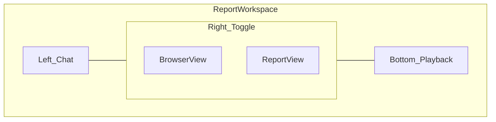

# Roadmap

*Repository-level direction. Not a duplicate of external tracker. Vision: [knowledge/vision.md](./knowledge/vision.md). Sequencing: [knowledge/execution.md](./knowledge/execution.md). Workspace interface: [docs/workspace-interface.md](./docs/workspace-interface.md).*

## Target report workspace interface

Descriptive spec for the report workspace chrome (not a priority stack). Full detail: [docs/workspace-interface.md](./docs/workspace-interface.md). Product context: [docs/product-prd.md](./docs/product-prd.md).

### Layout (desktop)

| Region | Purpose |
|--------|---------|
| **Left — Chat** | Persistent conversation with FixFlags: steering, Flag Q&A, what to fix first, lightweight product corrections. Activity stream may live here or above chat. Cheap router model (not judge pipeline). |
| **Right — Browser** | Dominant panel. Toggle **Browser view** vs **Report view** in the same workspace (not a separate route). |
| **Bottom — Playback** | Timeline/scrub strip for path replay and step evidence. Syncs with browser when a path or Flag evidence is selected. |

### Browser view modes

**Product review** — programmatic Playwright capture with screenshot-forward evidence (today’s pipeline). Live or stepped captures aligned to checks; not full agent autonomy.

**Deep review** — agent-class browser: autonomous navigation and interaction (multi-step journeys, funnel traversal, path recording). Public site explains this as agent-level browser exploration. See [How it works](/how-it-works) and [/docs/deep-review](/docs/deep-review).

### Report view

Finish Plan surfaces: progress band, Fix list, Flag detail, Funnel, Contract, previews, update review affordances. Same review record; switching views does not lose context.

### Morph behavior

- **During active review:** Agent left, public-safe Report right, and mobile defaults to Agent.
- **After complete:** the same transcript and Report remain mounted. Authenticated Timeline and paid Canvas are secondary right-panel modes.

Evolve `ReportWorkspaceShell` and progressive report parity; do not fork a second report app.

### Mobile

Full parity uses the **Agent ↔ Report** primary switch.
Authenticated Timeline uses the adapted inline playback layout on small screens.

### Customer labels

Product review, Deep review, Update review, Funnel, Path, Fix list — from `lib/marketing/copy/terminology.ts`. No re-check in customer UI.

## Recently closed

- **Beat Scout: precision over spectacle — shipped.** Network/API failure Flags, overlay click-blocker detection, structured action timeline, Product Contract, truth labels in model/API data. See board `beat-scout-precision` / `beat-scout-completeness`.
- **Docs and Help separation — shipped locally.** `/docs` owns product usage, reports, editor integrations, CLI, MCP, generated reference, search, and stable anchors. `/help` owns billing, account, failed checks, privacy, and human support. Credentialed production smokes for newly cataloged editors remain required before expanding the verified shipped-integration claim. See `lib/docs/`, `lib/integrations/`, `lib/help/`, and `DECISIONS.md`.
- **Monetization blockers — CLOSED.** Automated coverage in CI via `npm run test:unit`. See [QUALITY.md](./QUALITY.md).
- **Scan depth Phase 1 — shipped.** Flow scan, slop detection, preview cards, og:image validation.
- **Ultimate audit Phases 0–4 — shipped.** Playwright-only stack, narrative report, Journey Review MVP, MCP plan-mode + re-check next-fixes.
- **Beat Scout precision foundations — shipped.** Network/API Flags, overlay blockers, action timeline, Product Contract MVP, truth labels.

## Now

- **Agent-led Report Workspace (release proof)** — Unified Agent transcript left; public-safe Report, authenticated Timeline, and paid Canvas right. Deterministic scan messages are free; authenticated model chat is metered monthly. Mobile uses Agent ↔ Report. Canon: [docs/workspace-interface.md](./docs/workspace-interface.md), [docs/product-prd.md](./docs/product-prd.md). Completion: [`.agents/sessions/agent-workspace-completion.md`](./.agents/sessions/agent-workspace-completion.md).
  *Signal:* paste URL → truthful Agent updates on phone and desktop → complete public evidence report → authenticate into the same workspace → chat, Timeline, and paid Canvas → update review.

- **Product Hunt completion release** — canonical complete Fix list workspace, deterministic curated sample, claim retry integrity, scoped share grants, responsive/accessibility checks, route guards, and release verification. Canonical acceptance contract: `knowledge/report-contract.md`. First-value dogfood: [`.agents/sessions/customer-journey-completion-plan.md`](./.agents/sessions/customer-journey-completion-plan.md).
  *Signal:* anonymous URL → progressive complete Fix list with real evidence and no prompts → successful claim → authenticated fix prompts and Timeline → update review → diff; Studio password share → canonical report → revoke.

- **Launch Check Completeness** — every unresolved Flag ranked in one report, Contract merge-not-wipe, Remember UI, claim→Project, dogfood twin suppressions, Studio share honesty, Project product watch. Board `current-product-completion`.
  *Signal:* Contract edit keeps learnings; Copy all fixes includes every unresolved prompt; watch enqueues FULL re-check; regression email on watched projects.

- **Customer journey trust close** — Anon evidence placeholders, dishonest Copy toast, score/BLOCKED contradiction, nav CTA clarity. Brand Phase 0 done (`fix-live-images`). Board `customer-journey-completion`.
  *Signal:* Phases 1-3 of customer-journey-completion-plan accepted on production dogfood.

- **Pricing and metering** — Product review + deep review quotas enforced in code ($69/$199 Pro/Studio). See [docs/business-model.md](./docs/business-model.md). **Closed** in `lib/billing/plans.ts` + `lib/audit/usage.ts`.

- **Growth distribution** — anon → signed-up → paying conversion; upsell timing; re-engagement.
  *Signal:* >5% free-to-paid conversion.

- **Distribution harden** — Claim the initial `fixflags` npm package with operator 2FA, configure its trusted publisher, run the protected provenance release, then complete published-package CLI and MCP dogfood.

- **Residual hardening** — API route contract tests beyond critical path; auth/session coverage; Touch-tier matrix.
  *Evidence baseline:* [QUALITY.md](./QUALITY.md), [test-strategy.md](./test-strategy.md).

## Recently closed (also)

- **Product Intelligence Phase 0–1 foundations** — Project PI, Fix list UI, Remember writes, MCP context tools (thesis UI gaps closed in launch-check-completeness).
- **Dogfood audit quality** — Absorbed into launch-check-completeness.

## Readiness (reconciled)

Single honest baseline across [QUALITY.md](./QUALITY.md) and [test-strategy.md](./test-strategy.md):

| Tier | Readiness | Residual |
|------|-----------|----------|
| Truth | ~95% | Screenshot/flow/PageSpeed fixtures still not frozen into regression suite |
| Strength | ~85% | Remaining non-critical API routes; queue unit depth |
| Touch | ~35% | First-value dogfood gaps open (see customer-journey-completion-plan); density matrix still expanding |

Monetization blockers (regression fixtures, judge contract, persist layer, pipeline state machine, billing gating) are closed.

## Next

- **Product Memory evolution** — extend `Project.productIntelligence` toward the vision's Product Memory (expected behavior, important journeys, decisions, what "good" means) as usage proves out; reviews stay observations of the Product ([knowledge/vision.md](./knowledge/vision.md) → Product Memory).
- **First non-scan signal source** — pick the first Flag origin beyond scans (feedback, support, or deployment) and add `signalSource` to the Flag model.
- **Conversation and timeline** — evolve the workspace chat toward grounded Product Intelligence Q&A and the continuous product timeline (vision Experience; [docs/workspace-interface.md](./docs/workspace-interface.md)).
- **GitHub-native "Fix it for me"** — branch/PR path with fresh independent FixFlags verification before human merge (vision Fixing trust model; extends `repo-fix-pr`).
- **Repo signals into Fix list** — Optional repo connect feeds Implementation Integrity into the same prioritized list (entitlement expansion after thesis).
- **CLI understand / finish / verify / status** — Cloud-backed first; local runtime later ([knowledge/open-source.md](./knowledge/open-source.md)).
- **Evolution tracking** — Trend quality over time per Product / URL.
- **MCP proof and distribution** — deployed Lovable/Bolt connector smokes; PI tools refined.
- **Open community skills** — Extract the in-repo loop skill (`public/.well-known/skills/`, `ide-integrations/`) into a standalone OSS repo with Cursor, Claude Code, and Kiro install paths, an MCP tool contract manifest, and CI that lints skill tool names against the live MCP surface. Ship the core Check → Fix → Re-check loop only; keep internal operator skills (`.cursor/skills/fixflags-*`) proprietary. Accept community platform extensions (Lovable, Bolt, launch-gate, Re-check-only) via contribution templates. See [knowledge/open-source.md](./knowledge/open-source.md).
  *Signal:* one-command install of the core skill; help center MCP guide links to the canonical repo; community PRs pass tool-name contract lint; platform skills do not embed engine prompts or ranking logic.
- **Knowledge graph Phase 2** — Public issue/benchmark pages (growth graph, not customer PI). See `docs/growth/growth-roadmap.md`.

## Later

- Portable PI export + open protocol/local pieces
- Agent Integrity checks (instruction drift)
- Design Integrity as first-class pass
- CI/CD integration, team workspaces, white-label share branding
- Authenticated journey architecture (staged)
- Personas, testing modes, full session video (demand-triggered)
- Platform-native `.fixflags` subdomain trick
- Product Memory normalization into tables (only when query needs prove it)
- Product Graph representation (conceptual model; relational first, no graph DB until insufficient)
- Support conversations as Flag signals
- User/voice signal sources (session behavior, analytics connectors)

## Shipped retention (was Next)

- **Project product watch** — Prisma `watchInterval` / `watchNextRunAt`; recovery-scheduler tick; regression-only email. Pro/Studio. Manual re-check remains free for all owners.

## Not planned

- General coding agent / IDE / chatbot
- Customer-support platform (another Zendesk)
- Competing on generation ("a better Lovable")
- Migrating UI rubrics to five integrity dimensions before thesis validation
- Training shared models on customer Product Intelligence by default
- Open-sourcing the Intelligence Network
- Enterprise compliance reports (SOC2, HIPAA) as a product line
- Custom rubric creation
- Batch/API scanning for non-MCP use
- Desktop/mobile apps
- Bug bounty program
- On-premise deployment (until enterprise demand justifies)

## Completion signals

| Item | Signal |
|------|--------|
| PI thesis | Contract persistence + Fix list action + Remember on re-check |
| 100 paying users | Monetization blockers closed, conversion >5% |
| Studio viability | 10+ Studio subscribers, CI/CD or white-label share demand |
| Product-market fit | >20% MoM paid user growth for 3 consecutive months |
