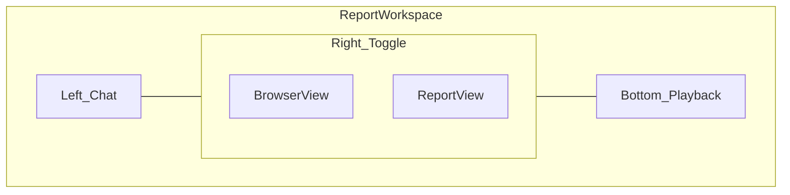

# Roadmap

*Repository-level direction. Not a duplicate of external tracker. Vision: [knowledge/vision.md](./knowledge/vision.md). Sequencing: [knowledge/execution.md](./knowledge/execution.md). Workspace interface: [docs/workspace-interface.md](./docs/workspace-interface.md).*

## Target report workspace interface

Descriptive spec for the report workspace chrome (not a priority stack). Full detail: [docs/workspace-interface.md](./docs/workspace-interface.md). Product context: [docs/product-prd.md](./docs/product-prd.md).

### Layout (desktop)

| Region | Purpose |
|--------|---------|
| **Left — Chat** | Persistent conversation with FixFlags: steering, Flag Q&A, what to fix first, lightweight product corrections. Activity stream may live here or above chat. Cheap router model (not judge pipeline). |
| **Right — Browser** | Dominant panel. Toggle **Browser view** vs **Report view** in the same workspace (not a separate route). |
| **Bottom — Playback** | Timeline/scrub strip for path replay and step evidence. Syncs with browser when a path or Flag evidence is selected. |

### Browser view modes

**Product review** — programmatic Playwright capture with screenshot-forward evidence (today’s pipeline). Live or stepped captures aligned to checks; not full agent autonomy.

**Deep review** — agent-class browser: autonomous navigation and interaction (multi-step journeys, funnel traversal, path recording). Public site explains this as agent-level browser exploration. See [How it works](/how-it-works) and [/docs/deep-review](/docs/deep-review).

### Report view

Finish Plan surfaces: progress band, Fix list, Flag detail, Funnel, Contract, previews, update review affordances. Same review record; switching views does not lose context.

### Morph behavior

- **During active review:** Agent left, public-safe Report right, and mobile defaults to Agent.
- **After complete:** the same transcript and Report remain mounted. Authenticated Timeline and Canvas are secondary right-panel modes.

Evolve `ReportWorkspaceShell` and progressive report parity; do not fork a second report app.

### Mobile

Full parity uses the **Agent ↔ Report** primary switch.
Authenticated Timeline uses the adapted inline playback layout on small screens.

### Customer labels

Product review, Deep review, Update review, Funnel, Path, Fix list — from `lib/marketing/copy/terminology.ts`. No re-check in customer UI.

## Recently closed

- **Beat Scout: precision over spectacle — shipped.** Network/API failure Flags, overlay click-blocker detection, structured action timeline, Product Contract, truth labels in model/API data. See board `beat-scout-precision` / `beat-scout-completeness`.
- **Docs and Help separation — shipped locally.** `/docs` owns the URL-first product loop, reports, deep reviews, update reviews, and troubleshooting. `/help` owns billing, account, failed reviews, privacy, and human support. Parked power-tool documentation remains in source but is absent from navigation and search.
- **Monetization blockers — CLOSED.** Automated coverage in CI via `npm run test:unit`. See [QUALITY.md](./QUALITY.md).
- **Scan depth Phase 1 — shipped.** Flow scan, slop detection, preview cards, og:image validation.
- **Ultimate audit Phases 0–4 — shipped.** Playwright-only stack, narrative report, Journey Review MVP, and update-review next fixes.
- **Beat Scout precision foundations — shipped.** Network/API Flags, overlay blockers, action timeline, Product Contract MVP, truth labels.

## Now

- **Game On completion closeout** — implementation commit `6c17558f` on `main` and `origin/main` contains the homepage, shared workspace, access, metering, Improvement lifecycle, verification receipt, release-contract, and terminology refactor, but it is not yet release-attested.
  *Resume signal:* follow [the implementation handoff](./.agents/handoffs/game-on-product-completion.md), complete the no-skip browser and full local gates, repair and create a new final SHA if needed, then collect CI, release-environment, registry, exact-SHA production, honest `IMPROVED`/`INCONCLUSIVE`, and promotion receipts.

- **Durable continuous improvement loop** — Product-scoped Improvements connect bounded Attention, evidence occurrences, builder attempts, fresh update-review verification receipts, regressions, and provenance-bearing Product Memory.
  *Signal:* URL-only Review produces zero to three worthwhile Improvements; a handoff creates an attempt; only a fresh child Review can produce `IMPROVED`, `UNCHANGED`, `REGRESSED`, or `INCONCLUSIVE`.

- **URL-first product recentering** — the dashboard leads with one URL field, then Product attention, action state, verification, scheduled Watch, and history; immutable reports remain evidence snapshots and shareable proof.
  *Signal:* a user can paste a URL, claim the same report, copy a fix, run an update review, and keep Watch without encountering parked power-tool entry points.

- **Minimal native Product Signals** — origin-bound browser context for navigation, named actions/outcomes, runtime errors, Core Web Vitals, and releases, with strict privacy and 30-day raw retention.
  *Signal:* undeclared or sensitive fields are rejected; missing instrumentation never blocks URL Review; signals remain `OBSERVED` evidence until judgment uses them.

- **Agent-led Report Workspace (release proof)** — Unified Agent transcript left; public-safe Report, authenticated Timeline, and Canvas right. Deterministic scan messages are free; authenticated model chat is metered monthly. Mobile uses Agent ↔ Report. Canon: [docs/workspace-interface.md](./docs/workspace-interface.md), [docs/product-prd.md](./docs/product-prd.md). Completion: [`.agents/sessions/agent-workspace-completion.md`](./.agents/sessions/agent-workspace-completion.md).
  *Signal:* paste URL → truthful Agent updates on phone and desktop → complete public evidence report → authenticate into the same workspace → chat, Timeline, and Canvas → update review.

- **Product Hunt completion release** — canonical complete Fix list workspace, deterministic curated sample, claim retry integrity, scoped share grants, responsive/accessibility checks, route guards, and release verification. Canonical acceptance contract: `knowledge/report-contract.md`. First-value dogfood: [`.agents/sessions/customer-journey-completion-plan.md`](./.agents/sessions/customer-journey-completion-plan.md).
  *Signal:* anonymous URL → progressive evidence teaser with no prompts → successful claim → complete report, fix prompts, and Timeline → update review → diff → protected share → revoke.

- **Launch Check Completeness** — every unresolved Flag ranked in one report, Contract merge-not-wipe, Remember UI, claim→Project, dogfood twin suppressions, protected share honesty, and scheduled Product Watch. Board `current-product-completion`.
  *Signal:* Contract edit keeps learnings; Copy all fixes includes every unresolved prompt; watch enqueues FULL re-check; regression email on watched projects.

- **Customer journey trust close** — Anon evidence placeholders, dishonest Copy toast, score/BLOCKED contradiction, nav CTA clarity. Brand Phase 0 done (`fix-live-images`). Board `customer-journey-completion`.
  *Signal:* Phases 1-3 of customer-journey-completion-plan accepted on production dogfood.

- **Usage pricing and metering** — the complete web product is available on every plan; Free, Pro ($29), and Studio ($79) differ only by monthly product review and deep review allowances. See [docs/business-model.md](./docs/business-model.md).

- **Growth distribution** — anon → signed-up → paying conversion; upsell timing; re-engagement.
  *Signal:* >5% free-to-paid conversion.

- **Park power-user surfaces** — keep their implementation intact while removing customer entry points, discovery, pricing promises, and launch dependencies.

- **Residual hardening** — API route contract tests beyond critical path; auth/session coverage; Touch-tier matrix.
  *Evidence baseline:* [QUALITY.md](./QUALITY.md), [test-strategy.md](./test-strategy.md).

## Recently closed (also)

- **Product Intelligence Phase 0–1 foundations** — Project PI, Fix list UI, Remember writes, and report context tools.
- **Dogfood audit quality** — Absorbed into launch-check-completeness.

## Readiness (reconciled)

Single honest baseline across [QUALITY.md](./QUALITY.md) and [test-strategy.md](./test-strategy.md):

| Tier | Readiness | Residual |
|------|-----------|----------|
| Truth | ~95% | Screenshot/flow/PageSpeed fixtures still not frozen into regression suite |
| Strength | ~85% | Remaining non-critical API routes; queue unit depth |
| Touch | Local launch matrix passed | Credentialed production role journeys and deployed first-value dogfood remain |

Monetization blockers (regression fixtures, judge contract, persist layer, pipeline state machine, billing gating) are closed.

## Next

- **Judgment quality** — use Product Contract, verified history, release linkage, frequency, affected outcomes, and source reliability to decide which zero-to-three Improvements deserve attention.
- **Product history and Agent grounding** — present Review → judgment → attempt → deployment → independent verification → outcome → learning with source provenance, never a raw event stream.
- **First external adapter** — add Sentry only after native error/release evidence proves a concrete judgment gap; add PostHog/Amplitude, Stripe, support, and GA/GSC one at a time after the preceding source changes a real decision.
- **Evolution tracking** — Trend quality over time per Product / URL.
- **Knowledge graph Phase 2** — Public issue/benchmark pages (growth graph, not customer PI). See `docs/growth/growth-roadmap.md`.

## Later

- Portable PI export + open protocol/local pieces
- Agent Integrity checks (instruction drift)
- Design Integrity as first-class pass
- Team workspaces and white-label share branding
- Authenticated journey architecture (staged)
- Personas, testing modes, full session video (demand-triggered)
- Platform-native `.fixflags` subdomain trick
- Product Memory normalization into tables (only when query needs prove it)
- Product Graph representation (conceptual model; relational first, no graph DB until insufficient)
- Support conversations as Flag signals
- User/voice signal sources (session behavior, analytics connectors)
- Generic analytics dashboards, funnels, cohorts, heatmaps, replay browsers, experiment management, and feature flags
- Broad ingestion platforms or arbitrary event explorers
- Team workspaces and enterprise governance
- Pricing migration away from reviews before verified-improvement usage evidence exists

## Shipped retention (was Next)

- **Scheduled Product Watch** — Prisma `watchInterval` / `watchNextRunAt`; recovery-scheduler tick; regression-only email. Available on every plan. Completed Watch reviews consume the monthly product review allowance and pause honestly at the limit.

## Parked, not scheduled

Repository scanning, editor protocols, command-line workflows, API-key setup, deployment-triggered hooks, and their distribution work remain in the codebase.
They are intentionally absent from the customer app, marketing, public documentation discovery, pricing, and launch gates until the URL-first product converts consistently.

## Not planned

- General coding agent / IDE / chatbot
- Customer-support platform (another Zendesk)
- Competing on generation ("a better Lovable")
- Migrating UI rubrics to five integrity dimensions before thesis validation
- Training shared models on customer Product Intelligence by default
- Open-sourcing the Intelligence Network
- Enterprise compliance reports (SOC2, HIPAA) as a product line
- Custom rubric creation
- Batch scanning
- Desktop/mobile apps
- Bug bounty program
- On-premise deployment (until enterprise demand justifies)

## Completion signals

| Item | Signal |
|------|--------|
| PI thesis | Contract persistence + Fix list action + Remember on re-check |
| 100 paying users | Monetization blockers closed, conversion >5% |
| Studio viability | 10+ Studio subscribers consistently using the higher monthly allowance |
| Product-market fit | >20% MoM paid user growth for 3 consecutive months |
