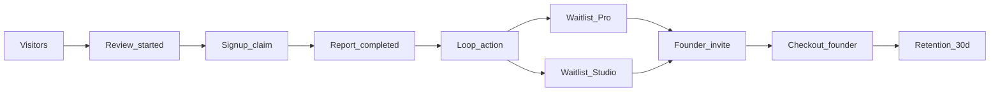

# GTM launch metrics

**Status:** Measurement definitions for hybrid launch + founder cohort (August 2026).

**Strategy:** [gtm-launch-strategy.md](./gtm-launch-strategy.md)

---

## Funnel

| Stage | Definition | Source |
|-------|------------|--------|
| Visitor | Session on marketing site | GA4 / `MarketingPageViewTracker` |
| Review started | Audit enqueued (anon or signed-in) | `lib/analytics/events.ts`, audit create |
| Signup / claim | Account created or anon report claimed | auth + claim flow |
| Report completed | Audit status `COMPLETED` | Prisma `Audit` |
| Loop action | Copy fix prompt or update review run | analytics events |
| Waitlist Pro | `PaidPlanWaitlistEntry` plan `BUILDER` | DB |
| Waitlist Studio | `PaidPlanWaitlistEntry` plan `TEAM` | DB |
| Founder invite | `invitedAt` set on waitlist row | DB / admin |
| Checkout | `started_checkout` / `completed_checkout` | analytics + Stripe webhook |
| Retention | Second review or active 30d post-pay | DB |

---

## Product Hunt success (mid-funnel)

Do not use waitlist count alone.

| Metric | Why |
|--------|-----|
| Reviews completed (PH week) | Wedge works |
| Free signups | Value worth saving |
| Pro waitlist joins | Pro payment intent |
| Studio waitlist joins | Studio payment intent |
| Qualified waitlist | Waitlist + ≥1 completed report |

**Example “ads ready” bar:** 200+ completed free reports, 30+ total waitlist, majority qualified, batch 1 waitlist→paid > ~10% on qualified cohort.

---

## Waitlist DB fields (admin)

| Field | Purpose |
|-------|---------|
| `userId` | Account |
| `plan` | `BUILDER` or `TEAM` |
| `joinedAt` | PH / campaign timing |
| `source` | pricing, dashboard, plan_picker, product_hunt, etc. |
| `campaign` | e.g. `founder_40_ph_2026` |
| `invitedAt` | Batch invite sent |
| `convertedAt` | Paid subscription started |
| `founderOfferId` | e.g. `founder_40_12m` |

**Usage joins (segmentation):**

- `auditsUsed` / `auditsLimit` on `User`
- Completed audit count
- `creditsExhausted` derived: `auditsUsed >= auditsLimit` (free) or monthly cap hit (paid)

---

## Analytics events

| Event | Payload | When |
|-------|---------|------|
| `waitlist_joined` | `plan`, `source` | Waitlist DB upsert success |
| `beta_interest_submitted` | `plan`, `email` | Legacy alias; keep for dashboards |
| `started_checkout` | `plan`, `is_logged_in` | Checkout initiated (`PAID_OPEN=true`) |
| `completed_checkout` | `plan` | Stripe success / dashboard toast |
| `viewed_pricing` | — | Pricing page |

---

## Stripe reporting

- Coupon redemption count per `founder_pro_40_12m` / `founder_studio_40_12m`
- MRR at discount vs list (Dashboard / exports)
- Subscription metadata `offer_id`

---

## Changelog

| Date | Change |
|------|--------|
| 2026-08-01 | Initial funnel + waitlist metrics for GTM launch. |
