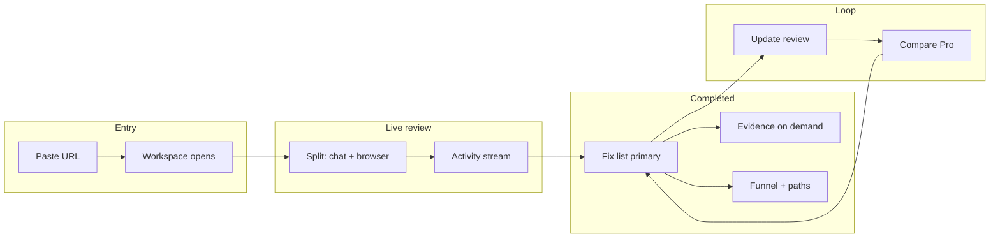

# Product UI intent (locked decisions)

**Status:** Approved direction (August 2026). Supplements [live-review-and-product-intelligence-prd.md](./live-review-and-product-intelligence-prd.md) with interface choices from founder questionnaire.

**Canonical for:** layout modes, dominant surfaces, chat, funnel/path playback, mobile parity, and next UI milestone.

**Implementation status:** Not started. Shipped UI remains report-first Finish Plan (`knowledge/report-contract.md`).

---

## 1) What the product feels like (three truths at once)

The interface must simultaneously deliver:

| Truth | User mental model |
|-------|-------------------|
| **Live session** | FixFlags is using my product right now. |
| **Sharp report** | I get a ranked Fix list with evidence, not vibes. |
| **Fix loop** | Flag → fix in my builder → update review until it’s clean. |

No single mode wins permanently. The workspace **morphs** from live observation into report work without feeling like a different product.

---

## 2) Primary layout (desktop)

### During active product review

**Split workspace (PRD §8):**

- **Left:** title, elapsed time, activity stream, **chat**, emerging findings, progress, user input.
- **Right:** **live product browser** — visually dominant (largest panel).

Activity stream and browser state stay synchronized to real pipeline events, not synthetic narration.

### Evolution path (not a rewrite cliff)

**2A + 2D:** Ship the split workspace as the target, but **reuse and extend** today’s report shell (`ReportWorkspaceShell`, progressive → completed parity, sticky wayfinding, Fix list explorer). New chrome wraps existing report primitives; do not fork a second report implementation.

### After review completes

**Dominant surfaces (3A + 3B):**

1. **Fix list** — ranked work queue; copy prompt; next action obvious.
2. **Evidence** — every Flag is provable (screenshots, path replay, inspect).

Score and verdict support the list; they do not replace it.

---

## 3) Entry and first value (4A)

- Homepage: URL + **Review my product** only (no tier picker before value).
- Submit → **workspace opens immediately** with honest progress (stages, partial Flags, capture placeholders).
- Sign-in unlocks full prompts, history, update reviews, and persistence — not a separate “wait for report” step.

Aligns with report-first scan handoff: navigate to `/report/[id]` with progressive UI, not a blocking interstitial.

---

## 4) Funnel and deep review (5A)

- **Same report**, not a separate product area.
- **Funnel** section: journeys listed inside the report map.
- **Path** opens from Funnel or from Flag evidence.
- **Deep review** is explicit product value inside that section (journeys + funnel + paths), not a hidden pipeline mode.

Customer terms: Funnel (section), path (playback unit). See `lib/marketing/copy/terminology.ts`.

---

## 5) Path playback (6C)

When a user opens a path:

- **Full session-style replay** in the browser panel — scrub timeline, step through actions, evidence continuity.
- Target experience: replay proves the finding; user does not need to imagine what FixFlags saw.

v1 may stage: timeline + browser sync first; polish scrub UX second. Direction is FullStory-grade replay in-product, not static screenshot galleries only.

---

## 6) Update review (7A + 7C)

- **Update review** is a **primary action** in report header (owner, completed report).
- **Compare is the payoff on Pro** — before/after proof after update review; diff strip (cleared / remaining / new) always visible on child reports.
- Customer term: **Update review** (not re-check). Internal route `/re-check` unchanged until API migration.

---

## 7) In-app chat (8A)

- **Chat always available** in the left panel (live + completed + update review context).
- Scope: explain Flags, steer review, ask “what should I fix first?”, lightweight corrections to product understanding.
- **Not** a general coding agent; stays on product QA.

### Model constraint (cost)

Use the **cheapest viable chat model** on OpenRouter (or equivalent router) — e.g. small/free-tier models — for in-app conversation. Product judgment and Flags remain on the existing audit/judge pipeline; chat is explanatory and steering, not a second expensive reviewer.

Requirements:

- Separate chat model config from judge/triage models.
- Hard cap or rate limit per session/plan.
- Degrade to canned actions (“Explain this Flag”) if provider unavailable.

---

## 8) Mobile parity (9C — launch-critical)

Mobile is **not** a degraded subset. Every core capability must work on phone:

- Start product review
- Watch progress / activity
- Chat with FixFlags
- Browse Fix list and Flag detail
- View evidence and path replay (adapted layout)
- Run update review and see diff
- Account, billing, usage meters

### Lovable-inspired patterns (reference, not clone)

Study [Lovable preview](https://docs.lovable.dev/features/projects/preview) and responsive builder UX:

| Pattern | Apply to FixFlags |
|---------|-------------------|
| **Device toggle** above preview (desktop / tablet / mobile) | Toggle **product viewport** inside browser panel on desktop; on phone, **Chat ↔ Product** as primary view switch (tabs or bottom bar). |
| **Live preview always central** | Product panel stays the hero; chat/findings are peer, not buried in menus. |
| **Mobile-first layouts** | Stack panels; single-column Fix list; full-width evidence; 44px targets. |
| **Preview on real device** | “Open on phone” / share preview link for testing captured URL on device. |
| **No feature stripping** | Avoid “desktop only” for replay, chat, or update review. |

Implementation note: responsive **modes** not separate mobile app. See `DESIGN.md` → Responsive behavior.

---

## 9) Next UI milestone (10A)

**Primary bet:** **Live workspace** — split layout, synchronized activity stream, browser panel, in-app chat, progressive → completed morph.

Secondary in same initiative:

- Funnel section + path replay scaffold (timeline → full replay)
- Update review header CTA + compare payoff wiring
- Mobile parity pass (Lovable-style view switching)

Defer: dashboard/release hub redesign until workspace loop feels right on desktop + mobile.

---

## 10) Mode map (summary)

---

## 11) Relationship to shipped UI

| Area | Today | Target |
|------|-------|--------|
| Layout | Report-first single column | Split during live; report chrome after complete |
| Browser | Screenshots in Flag detail | Live + replay in right panel |
| Chat | MCP/CLI only | In-app left panel (cheap model) |
| Funnel | Section title + journey list | + path replay in browser panel |
| Mobile | Responsive report | Full-featured Chat ↔ Product parity |

Report contract section order may evolve; update `knowledge/report-contract.md` when workspace ships. Funnel anchor: `report-funnel`.

---

## 12) Open design questions (next bounce)

Answer in follow-up sessions; do not block workspace scaffold:

1. Chat ↔ Product on mobile: bottom tabs vs swipe vs FAB drawer?
2. Path replay: inline in report vs full-screen takeover on small screens?
3. Deep review teaser on Free: one journey playback vs summary-only?
4. Takeover (user controls browser): v1 or v2?

---

## Changelog

| Date | Change |
|------|--------|
| 2026-08-01 | Locked from founder questionnaire (10Q condensed). |
