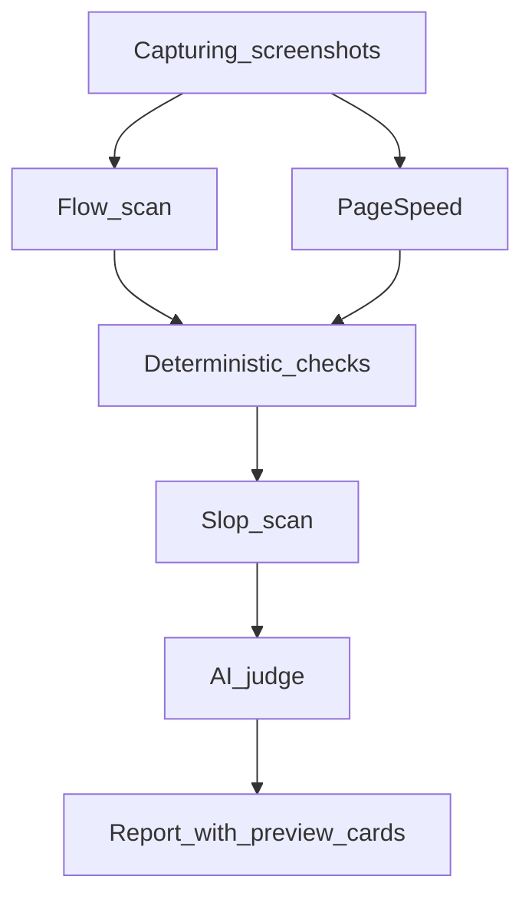

# Scan Roadmap

*Last updated: 2026-07-14*

Phased plan to expand FixFlags scans. Every phase must serve the core loop: **check → fix → re-check → prove**.

Full scan list by rubric: [scan-catalog.md](./scan-catalog.md).

**Policy note:** Every scan module must serve the core loop (Flag → Fix → Re-check). Ship fewer things better, not more things worse.

---

## Pipeline (current)

**Version:** `PIPELINE_VERSION` `2.3.0` (`lib/audit/pipeline-config.ts`)

---

## Phase 1 — Complete

**Goal:** Catch embarrassing AI-ship failures before share — dead CTAs, placeholder copy, blank link previews.

| Deliverable | Rubric | Method | Status |
|-------------|--------|--------|--------|
| **Slop scan** | Message | deterministic | Shipped (4 check IDs) |
| **Flow scan MVP** | Experience | agent | Shipped (5 check IDs, re-check verifies flow flags) |
| **Preview cards UI** | Reach | UI | Shipped (Google snippet + social card) |
| **og:image validation** | Reach | deterministic | Shipped (`og-image-broken`) |
| **Flow timeline UI** | Experience | UI | Shipped (step strip + failure states) |
| **Docs** | — | — | scan-catalog.md, this file, cross-links |

### Exit criteria (met)

- [x] Re-check marks flow flags FIXED/REGRESSED via `applyDeterministicVerification` + flow re-run
- [x] Flow click uses stable `data-fixflags-flow-idx` selectors
- [x] Single landing capture (desktop screenshot reused as flow step 0)
- [x] Preview cards use design tokens; broken og:image flagged and shown
- [x] `npm run verify` green

---

## Phase 2 — Complete

| Deliverable | Rubric | Notes |
|-------------|--------|-------|
| Measurement scan | Reach | GA4/GTM/PostHog/Plausible presence (`analytics-missing`) — **Shipped** |
| CTA focus scan | Message | Competing primary CTAs above the fold (`competing-ctas`) — **Shipped** |
| Auth & checkout smoke | Experience | Auth/checkout links resolve, incl. cross-origin Stripe (`auth-page-broken`, `checkout-link-dead`) — **Shipped** |
| Flow scan (message layer) | Message | CTA destination matches headline promise (`flow-cta-message-mismatch`) — **Shipped** |

**Exit criteria:** 3 new scan modules — **met** (measurement, CTA focus, auth & checkout smoke), each verified on re-check.

**Deferred (not shipped):** CTA contrast scan — reliable in-browser contrast needs background/gradient resolution that is error-prone, so it was omitted rather than shipped flaky.

---

## Phase 3

| Deliverable | Rubric | Notes |
|-------------|--------|-------|
| Secret leak scan | Reach | API keys in source/bundles — **demand-triggered** (Agency ICP pain) |
| Expanded critical path | Experience / Reach | Sitemap + BFS corridor discovery + cross-page OG consistency (`corridor-og-*`) — **Shipped** |
| Journey Review (Pro+) | Experience | Playwright multi-step first-visit / pricing / signup / contact walks — **Shipped MVP** |
| Real device mobile | Experience | iPhone Safari + Android Chrome via BrowserStack/LambdaTest — **demand-triggered** (mobile accuracy complaints) |

**Exit criteria (partial):** Corridor OG flags + Journey Review MVP live. Real-device screenshots deferred until accuracy demand.

---

## Phase 4

| Deliverable | Notes |
|-------------|-------|
| ~~Repo-connected codebase scanning~~ | **Shipped, not roadmap.** GitHub OAuth connect, repo allow-listing, on-demand scan, and a dedicated report at `/report/repo/[id]` are live on Agency plan (`/settings/integrations`). Findings-only today (secrets, dependency hygiene, dangerous patterns) — see `docs/offering.md`. |
| CI deploy gate | GitHub Action / webhook; fail on launch gate regression — **trigger:** 10+ Agency subscribers |
| Weekly pulse | Scheduled re-check digest email on REGRESSED flags — **trigger:** habit retention data (not a paid re-check substitute) |
| Auto-fix PRs on repo scans | Open a PR with fixes applied, not just findings — natural next step once repo scanning has usage data |
| Consent-blocking measurement | `measurement-consent-scan` capability — **trigger:** after measurement false-positive review |
| Staging / password URLs | **trigger:** feature-request volume |
| Vision fallback for journeys | Canvas / no-ARIA pages — **trigger:** journey accuracy plateau |
| Graph `/issues/[checkId]` | **trigger:** `MIN_SAMPLE_SIZE` (20) met in production |

**Exit criteria:** One CI integration doc; pulse cron job in worker.

---

## Phase 5

| Deliverable | Notes |
|-------------|-------|
| Native app scan | Real device tap-through for mobile apps |
| Store listing scan | App Store / Play Store metadata |

**Exit criteria:** Native app audit mode documented and gated.

---

## References

- Check ID registry: `lib/audit/check-ids.ts`
- Verification rules: `lib/audit/verify-flags.ts`
- Pipeline config: `lib/audit/pipeline-config.ts`
