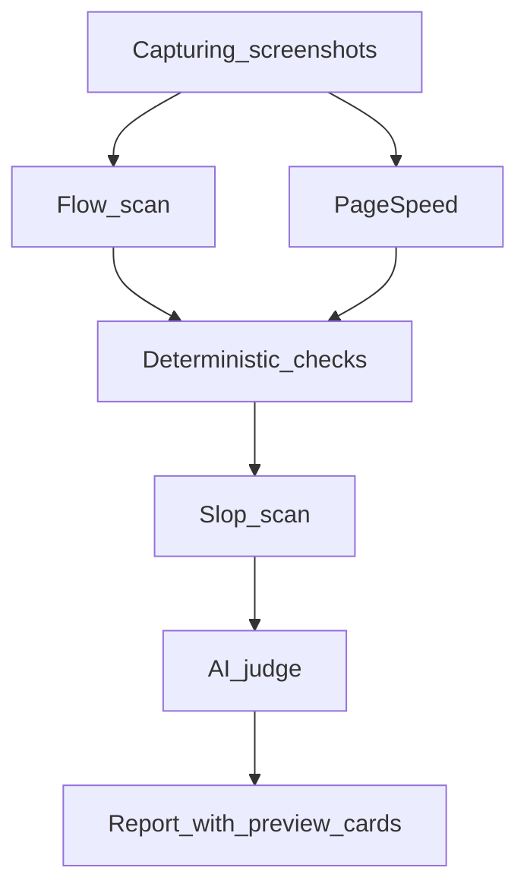

# Scan Roadmap

Phased plan to expand FixFlags scans. Every phase must serve the core loop: **check → fix → re-check → prove**.

Full scan list by rubric: [scan-catalog.md](./scan-catalog.md).

**Policy note:** [offering.md](./offering.md) defers most new features until 100 paying users. Phase 1 is the validated exception — flow scan, slop detection, and preview cards directly strengthen the loop for AI builders shipping public URLs.

---

## Pipeline (current + Phase 1)

---

## Phase 1 (now)

**Goal:** Catch embarrassing AI-ship failures before share — dead CTAs, placeholder copy, blank link previews.

| Deliverable | Rubric | Method | Exit criteria |
|-------------|--------|--------|---------------|
| **Slop scan** | Message | deterministic | 4 new check IDs; unit tests pass |
| **Flow scan MVP** | Experience | agent | CTA click-through with step screenshots; flags on 404/dead-end |
| **Preview cards UI** | Reach | UI | Google snippet + social card rendered in report |
| **Flow timeline UI** | Experience | UI | Step strip in report when flowData present |
| **Docs** | — | — | scan-catalog.md, this file, cross-links |

**Out of scope:** Form fill, LLM-planned journeys, real devices, new entitlements.

**Version:** `PIPELINE_VERSION` → `2.1.0`

---

## Phase 2

| Deliverable | Rubric | Notes |
|-------------|--------|-------|
| CTA focus scan | Message / Experience | Annotated mobile screenshot, contrast, competing CTAs |
| Measurement scan | Reach | GA4/GTM/PostHog, conversion events, consent |
| Auth & checkout smoke | Experience | Login loads, OAuth wired, Stripe links resolve |

**Exit criteria:** 3 new scan modules; re-check verifies measurement-related flags.

---

## Phase 3

| Deliverable | Rubric | Notes |
|-------------|--------|-------|
| Secret leak scan | Reach | API keys in source/bundles |
| Expanded critical path | Experience / Reach | 5–7 URLs; cross-page OG consistency |
| Real device mobile | Experience | iPhone Safari + Android Chrome via BrowserStack/LambdaTest |

**Exit criteria:** Real device screenshots in report; 2 device profiles minimum.

---

## Phase 4

| Deliverable | Notes |
|-------------|-------|
| CI deploy gate | GitHub Action / webhook; fail on launch gate regression |
| Weekly pulse | Scheduled re-check; email on REGRESSED flags |

**Exit criteria:** One CI integration doc; pulse cron job in worker.

---

## Phase 5

| Deliverable | Notes |
|-------------|-------|
| Native app scan | App Store / Play Store listing audit |
| Real device app flow | Maestro/BrowserStack tap-through |

**Packaging:** Studio tier or add-on — keeps web product focused.

---

## Implementation files (Phase 1)

| Area | Files |
|------|-------|
| Slop | `lib/audit/checks/slop.ts` |
| Flow | `lib/audit/flow/discover-cta.ts`, `run-flow-scan.ts`, `checks/flow.ts` |
| UI | `components/audit/PreviewCards.tsx`, `FlowScanTimeline.tsx` |
| Pipeline | `lib/audit/screenshot.ts`, `runner.ts`, `prisma/schema.prisma` (`flowData`) |
| Registry | `check-ids.ts`, `verify-flags.ts`, `checks/index.ts` |
