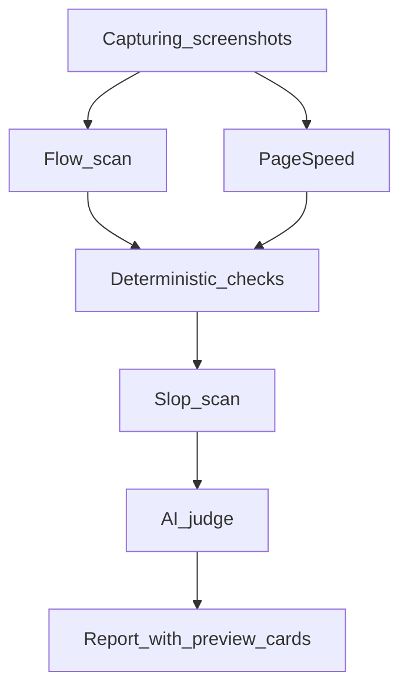

# Scan Roadmap

Phased plan to expand FixFlags scans. Every phase must serve the core loop: **check → fix → re-check → prove**.

Full scan list by rubric: [scan-catalog.md](./scan-catalog.md).

**Policy note:** [offering.md](./offering.md) defers most new features until 100 paying users. Phase 1 is the validated exception — flow scan, slop detection, and preview cards directly strengthen the loop for AI builders shipping public URLs.

---

## Pipeline (current)

---

## Phase 1 — Complete

**Goal:** Catch embarrassing AI-ship failures before share — dead CTAs, placeholder copy, blank link previews.

| Deliverable | Rubric | Method | Status |
|-------------|--------|--------|--------|
| **Slop scan** | Message | deterministic | Shipped (4 check IDs) |
| **Flow scan MVP** | Experience | agent | Shipped (5 check IDs, re-check verifies flow flags) |
| **Preview cards UI** | Reach | UI | Shipped (Google snippet + social card) |
| **og:image validation** | Reach | deterministic | Shipped (`og-image-broken`) |
| **Flow timeline UI** | Experience | UI | Shipped (step strip + failure states) |
| **Docs** | — | — | scan-catalog.md, this file, cross-links |

### Exit criteria (met)

- [x] Re-check marks flow flags FIXED/REGRESSED via `applyDeterministicVerification` + flow re-run
- [x] Flow click uses stable `data-fixflags-flow-idx` selectors
- [x] Single landing capture (desktop screenshot reused as flow step 0)
- [x] Preview cards use design tokens; broken og:image flagged and shown
- [x] `npm run verify` green

**Version:** `PIPELINE_VERSION` `2.1.0`

---

## Phase 2 (next)

| Deliverable | Rubric | Notes |
|-------------|--------|-------|
| Measurement scan | Reach | GA4/GTM/PostHog/Plausible presence (`analytics-missing`) — **Shipped** |
| CTA focus scan | Message / Experience | Annotated mobile screenshot, contrast, competing CTAs |
| Flow scan (message layer) | Message | CTA destination matches headline promise |
| Auth & checkout smoke | Experience | Login loads, OAuth wired, Stripe links resolve |

**Exit criteria:** 3 new scan modules; re-check verifies measurement-related flags. Measurement scan shipped (`analytics-missing`, verified on re-check).

---

## Phase 3

| Deliverable | Rubric | Notes |
|-------------|--------|-------|
| Secret leak scan | Reach | API keys in source/bundles |
| Expanded critical path | Experience / Reach | 5–7 URLs; cross-page OG consistency |
| Real device mobile | Experience | iPhone Safari + Android Chrome via BrowserStack/LambdaTest |

**Exit criteria:** Real device screenshots in report; 2 device profiles minimum.

---

## Phase 4

| Deliverable | Notes |
|-------------|-------|
| CI deploy gate | GitHub Action / webhook; fail on launch gate regression |
| Weekly pulse | Scheduled re-check; email on REGRESSED flags |

**Exit criteria:** One CI integration doc; pulse cron job in worker.

---

## Phase 5

| Deliverable | Notes |
|-------------|-------|
| Native app scan | Real device tap-through for mobile apps |
| Store listing scan | App Store / Play Store metadata |

**Exit criteria:** Studio-tier native app audit mode documented and gated.

---

## References

- Check ID registry: `lib/audit/check-ids.ts`
- Verification rules: `lib/audit/verify-flags.ts`
- Pipeline config: `lib/audit/pipeline-config.ts`
