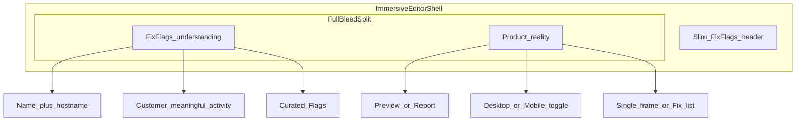

# Report workspace interface

> Current product surface: the workspace keeps Agent beside the reviewed Product. Preview shows live capture, Report presents the complete ranked fix list, Timeline replays owner evidence, and Canvas creates private evidence-grounded artifacts. Repository scanning is parked from discovery and new starts; protected historical data and GitHub revocation remain available.

**Status:** Approved interface spec (August 2026). Engineering and design source for report workspace chrome.

**Canonical for:** layout regions, view modes, browser modes, playback strip, mobile behavior, and on-screen terminology.

**Related:** Product requirements live in [product-prd.md](./product-prd.md). Visual tokens and component rules live in [DESIGN.md](../DESIGN.md). Report section order and anchors follow [knowledge/report-contract.md](../knowledge/report-contract.md) (Funnel anchor: `report-funnel`).

**Implementation:** The interactive split workspace lives in [ReportWorkspaceSplitShell](../components/report/ReportWorkspaceSplitShell.tsx) with progressive parity in [AuditReportProgressive](../components/audit/AuditReportProgressive.tsx). Do not fork a second report app.

---

## Layout regions (desktop)

| Region | Purpose |
|--------|---------|
| **Left — FixFlags understanding** | Product identity, customer-meaningful review activity, observations, confirmed Flag announcements, judgment, and authenticated report conversation. Technical execution logs and simulated reasoning never appear here. |
| **Right — Product reality and Review** | The live Product, interaction, and captured evidence while a review runs. The completed public-safe Report becomes the default after completion; authorized viewers switch among URL-backed Timeline, Report, and Canvas siblings. |

**Editor chrome (locked):**

- Full-bleed under thin site chrome: `h-[calc(100dvh-header)] w-full`. Do not inset the split in `Container variant="report"` / `max-w-6xl`.
- No pane cards. Agent and Product columns are flat surfaces separated by a single vertical divider (`border-r`), not `rounded-card`, `shadow-card`, `glass-surface`, or pane rings.
- Desktop grid: `minmax(280px, 32%)_minmax(0, 1fr)` with `gap-0`. Left is thinner than right. Both panes `min-h-0` with internal scroll.
- Scanning and completed reviews share one continuous shell. Completed reports do not jump to a hero/summary document above the split; score, Flags, and actions live in Product Report mode.
- Preview shows one `BrowserFrame` at a time. Do not stack desktop and mobile frames.
- Selecting a Flag overlays the measured evidence target on that capture. The overlay uses `EvidenceSpotlight` and must not change stage size. Page-scope and unmeasured Flags show `EvidenceChip` instead of a box.
- Homepage marketing preview emulates this same editor with curated sample evidence (`getCuratedSampleAudit` / static sample + `buildFixFlagsScanMessages`). Never call `/api/checks` from marketing. Demo identity is **Launchpad** / `fixflags.com/demo`. Every published observation owns distinct generated captures under `/samples/observations/<observation-id>/` plus revision, source path, hashes, date, score, Flags, Timeline, and evidence anchors in the checked-in capture manifest.

**Product pane is a fixed three-row stage (locked):**

| Row | Rule |
|-----|------|
| Header | Product name and the reviewed address including its path (`displaySiteAddress`). Preview-first view toggle with Eye / FileText icons. When Preview is active, Monitor / Smartphone device icons sit beside that toggle. Any mid-scan control occupies a reserved slot. |
| Stage | `WORKSPACE_STAGE_CLASS` from [workspace-geometry.ts](../components/report/workspace-geometry.ts). It is a flex column with a small-screen floor, because a stacked pane has no definite parent height and an `h-full` capture inside a block stage measures zero. The capture letterboxes inside it with `object-contain object-center` and never sizes it. |
| Transport | [WorkspacePreviewTransport](../components/report/WorkspacePreviewTransport.tsx), a `shrink-0 border-t` sibling of the stage, always the last row whenever Preview is active. Path scrub, step chips, and status only — device switching lives in the header. |

- No browser chrome inside the editor. `BrowserFrame` renders `chrome="none"` and `fill` here; `chrome="browser"` is only for marketing and compare surfaces where no pane header carries the URL.
- Switching Desktop to Mobile, selecting a playback step, or loading a capture changes only the letterboxed image. The stage container keeps identical geometry, and capture entry is opacity-only (`animate-capture-fade`).
- The transport keeps one fixed height in every state and degrades honestly instead of disappearing: capture progress while scanning, scrub and step chips for entitled viewers, status plus the Timeline gate for anonymous and password-share viewers.
  No live Timeline payload reaches a gated viewer.
  Repository-owned curated samples may replay their static versioned Timeline fixtures publicly.
- Anything that streams in mid-scan reserves its space first: the findings strip holds its row from the moment findings can stream, and progress readouts use `tabular-nums` in a fixed-width slot.
- The immersive shell carries no floating support bubble (`AuditShell` passes `showSupport={false}`). The Agent column is the chat surface, and a floating launcher would sit on top of the docked transport.
- Agent column is chat: one Flag mark (animated `ScanWorkingMark` while scanning), bubble transcript, one-row composer with ArrowUp send. Anonymous viewers see the composer; submit gates to `/sign-in?next=…` and never posts chat. There is no "Working · N%" strip above the transcript.
- Report mode uses `ReportExplorer` master/detail (list left, detail + `FixPromptBlock` right). Homepage and samples reuse that explorer; they do not hand-roll Flag cards.
- Report mode is itself a three-row pane, mirroring Preview (see "Report mode anatomy" below).
- Small screens use `WorkspaceMobileTabs` (Agent, Preview/Timeline, Report, Canvas) over one Product pane. Marketing emulations use the same bar so a stacked homepage card cannot bury the capture.
- `/samples` fills its marketing card (`h-full`). The live report route is the only surface that uses `h-[calc(100dvh-3.5rem)]`.
- An absent `observation` selects the current curated Review. An explicit unpublished ID returns not found; it never substitutes a different Review or queries production.

---

## View modes (right panel toggle)

### Timeline view

Shows the product as FixFlags experienced it.
Live reports require owner authorization; repository-owned curated samples use public static playback.

**Product review mode** — programmatic capture. Playwright-driven browser with screenshot-forward evidence (today’s pipeline). User sees live or stepped captures aligned to checks; not full agent autonomy.

**Target browser mode** — progressively richer path exploration inside Product Reviews. Multi-step journeys, funnel traversal, and path recording do not create a second customer product or pricing meter.

### Report view

Report is the default public-safe view and shows the ranked Fix list and Flag detail inside `#report-flags`.
Prompt actions remain authenticated even when their evidence is public.

**Report mode anatomy (locked):**

| Row | Rule |
|-----|------|
| Review header | [ReportOutcomeBar](../components/report/ReportOutcomeBar.tsx) is the fixed compact header and owns only visible Score, honest pending/unavailable state, full-Review history, and determinate scan progress. It contains no gauge, verdict excerpt, Critical shortcut, or next-step prose. |
| Body | [ReportPane](../components/report/ReportPane.tsx) wraps the explorer with `data-report-frame` and `WORKSPACE_REPORT_FRAME_CLASS`. Above the split width the frame takes one pane height and the list and detail columns each scroll internally; below it the frame releases its height and the pane scrolls as one column. |
| Review context | [ReportContextDisclosure](../components/report/ReportContextDisclosure.tsx) collects stack, contract, memory, funnel, previews, launch gates, feedback, and pipeline proof in one disclosure that is collapsed by default and auto-expands when a report anchor targets a section inside it. |

**Pane-relative, never viewport-relative.**
The explorer lives inside a pane whose width has nothing to do with the viewport, so `ReportExplorer` uses container queries (`@container/pane` from `WORKSPACE_PANE_SCROLL_CLASS`, `@[40rem]/pane:` for the master/detail split) and carries no `lg:` breakpoint, no `100vh` cap, no `--header-offset` sticky, and no `overflow-clip` shell.
Severity, impact, and page filters are always visible, because hiding them at narrow viewports hid them exactly where the pane needed them.
Anchors and `goToFlag` scroll the nearest scroll parent through [scroll-to-section.ts](../lib/report/scroll-to-section.ts), never the document.

Guarded by [workspace-geometry.test.ts](../components/report/__tests__/workspace-geometry.test.ts), `npm run ui:drift-guard`, and `node scripts/report-pane-proof.mjs`.

### Canvas view

Canvas is a paid, private, versioned visual artifact generated from an authorized evidence bundle.
Canvas documents use validated FixFlags blocks and never execute model-generated HTML, JavaScript, CSS, or external requests.

---

## Morph behavior

| Phase | Default right panel | Chrome |
|-------|---------------------|--------|
| **Active review** | Preview view | FixFlags understanding on the left; live Product and captured evidence on the right; mobile defaults to Agent |
| **After complete** | Report view | Agent remains mounted; authenticated Timeline and paid Canvas are secondary modes |

The workspace fills the available viewport beneath thin site chrome and has no marketing footer.
During an active review, Product name and hostname live in the FixFlags pane instead of a separate report hero.
Report and Preview controls belong to the Product pane header.
Below-report context such as technology and Product Contract does not compete with the live Product while scanning.

---

## Funnel, paths, and playback

- **Funnel** — journeys listed inside the report map (same report, not a separate product area).
- **Path** — opens from Funnel or Flag evidence; full session-style replay in the browser panel with scrub timeline and evidence continuity.
- **Transport** — docked at the bottom of the Product pane whenever Preview is active, on every width. It carries the scrub, step chips, and capture status. Device icons live in the Product header next to Preview. Target is replay-grade scrub in-product, not static screenshot galleries only.

---

## Update review

- **Update review** appears once in the completed owner report’s canonical action section, never in the compact Score/history header.
- Anonymous, shared, non-owner, and static sample workspaces never receive an actionable update-review control.
- **Compare** is the Pro payoff after an update review; its raw diff says no longer observed, remaining, new, or regressed.
- Verification receipts separately report `IMPROVED`, `UNCHANGED`, `REGRESSED`, or `INCONCLUSIVE`.
- Copying a prompt records a handoff and never declares verification.
- Only `IMPROVED` may write verified Product Memory; partial or degraded reviews never do.
- Customer term: **Update review** (not re-check). Internal route `/re-check` may remain until API migration.
- Every signed-in manual update review consumes exactly one product-review credit.
- Completed scheduled Studio reviews consume one product-review credit.

---

## Agent policy

- Deterministic Agent scan messages are visible with the authorized anonymous evidence report and consume no model tokens.
- Interactive Agent conversation is authenticated and scoped to the selected report session.
- Programmatic and model responses use one message envelope and transcript while retaining internal source metadata for truth and accounting.
- Scope: accept a URL through the canonical check path, explain Flags, answer what to fix first, and apply lightweight corrections to product understanding.
- The Agent is not a general coding agent.
- **Model:** cheapest viable chat model, configured separately from judge and triage. `CHAT_MODEL` / `CHAT_MAX_TOKENS` / `CHAT_TIMEOUT_MS` default to the cheapest model per provider; `CHAT_BASE_URL` routes chat through an OpenAI-compatible gateway (for example the opencode gateway) as the router equivalent.
- Requirements: separate chat model config from judge/triage; monthly account usage measured from provider-reported input and output tokens; programmatic messages excluded from usage; explicit provider failure and retry states; deterministic actions grounded in report Flags remain available where no model is required.
- The title-free Agent toolbar exposes History immediately left of New scan.
- New scan switches the composer to URL mode and reuses `/api/checks`; it never creates a second scan pipeline.

---

## Mobile

Full parity. No degraded subset.

| Capability | Requirement |
|------------|-------------|
| Start product review | Yes |
| Watch progress / activity | Yes |
| Chat with FixFlags | Yes |
| Browse Fix list and Flag detail | Yes |
| View evidence and path replay | Adapted layout |
| Run update review and see diff | Yes |
| Account, billing, usage meters | Yes |

**Primary switch:** one tab bar for the whole review — Agent, Preview/Timeline, Report, and Canvas when it is available.
The same bar and the same Product pane serve a running scan and a completed report, so nothing about the mobile shell changes at completion.
Active scans default to Agent on mobile.
When the completed server report replaces the active review, Report becomes the default on mobile and desktop.
Which surface the Product column shows is the same `view` state the desktop toggle sets, so the two never diverge.

**Playback on small screens:** authenticated Timeline uses the adapted inline playback layout.
A full-screen takeover is a later enhancement, not an unresolved requirement for this workspace.

**Patterns (reference, not clone):** device toggle in the Product header; live preview stays central; 44px targets; “Open on phone” / share preview link for testing captured URL on device.

---

## Customer labels on chrome

Wire from [lib/marketing/copy/terminology.ts](../lib/marketing/copy/terminology.ts):

| Label | Use on chrome |
|-------|----------------|
| Product review | Standard full pass with journey, Funnel, and path evidence where available |
| Update review | Fresh owner-triggered review on the same URL (report action section) |
| Funnel | Report section |
| Path | Playback unit |
| Fix list | Ranked work queue |

Do not show **re-check** in customer UI.

---

## Shipped vs target (interface)

| Area | Today | Target |
|------|-------|--------|
| Layout | Full-bleed flush split; no pane cards; same shell scan→complete | Same |
| Browser | Constant stage, no fake chrome; selected playback step renders that captured frame | Richer live path exploration inside Product Reviews |
| Playback | Docked transport with Desktop\|Mobile, scrub, and step chips; browser stage updates on select; `?step=N` replay from Flag/Funnel evidence | Full session-style takeover replay |
| Agent | One transcript; programmatic output is public-safe and free, model conversation is authenticated and metered monthly | Same |
| Funnel | Section + journey list + Replay path into the workspace browser | Same |
| Mobile | One tab bar (Agent, Preview/Timeline, Report, Canvas) over the same Product pane, scanning and completed | Full-screen Timeline takeover may be evaluated later |
| View toggle | Active review defaults to Preview; completed review defaults to Report; live Timeline owner-authorized; static sample Timeline public; Canvas paid | Same |

## Resolved design questions

1. Mobile uses one tab bar for Agent and every Product surface, identical while scanning and after completion.
2. Authenticated Timeline uses inline playback and step evidence on all sizes.
3. Full-screen Timeline and browser takeover are follow-on ideas, not incomplete workspace requirements.
4. Anonymous live-report and non-owner viewers receive no Timeline payload or journey playback.
5. Repository-owned samples may expose only complete, versioned static Timeline fixtures.
