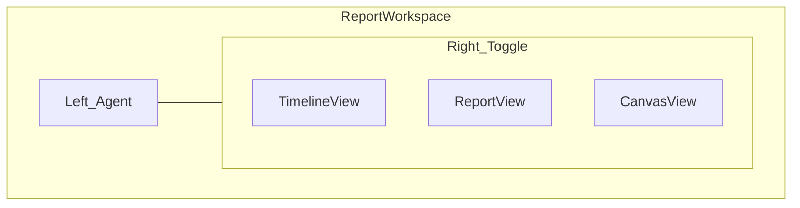

# Report workspace interface

**Status:** Approved interface spec (August 2026). Engineering and design source for report workspace chrome.

**Canonical for:** layout regions, view modes, browser modes, playback strip, mobile behavior, and on-screen terminology.

**Related:** Product requirements live in [product-prd.md](./product-prd.md). Visual tokens and component rules live in [DESIGN.md](../DESIGN.md). Report section order and anchors follow [knowledge/report-contract.md](../knowledge/report-contract.md) (Funnel anchor: `report-funnel`).

**Implementation:** The interactive split workspace lives in [ReportWorkspaceSplitShell](../components/report/ReportWorkspaceSplitShell.tsx) with progressive parity in [AuditReportProgressive](../components/audit/AuditReportProgressive.tsx). Do not fork a second report app.

---

## Layout regions (desktop)

| Region | Purpose |
|--------|---------|
| **Left — Agent** | One transcript for deterministic scan messages, confirmed Flag announcements, and authenticated report conversation. A title-free toolbar contains History followed by New scan. |
| **Right — Product** | The public-safe Report is the default value surface. Authenticated users can switch to Timeline; paid users can switch to Canvas. |

---

## View modes (right panel toggle)

### Timeline view

Shows the product as FixFlags experienced it and requires authentication.

**Product review mode** — programmatic capture. Playwright-driven browser with screenshot-forward evidence (today’s pipeline). User sees live or stepped captures aligned to checks; not full agent autonomy.

**Deep review mode** — agent-class browser. Autonomous navigation and interaction comparable to power-user browsing (multi-step journeys, funnel traversal, path recording). Public marketing explains this as agent-level browser exploration without naming competitors as endorsement.

### Report view

Report is the default public-safe view and shows the ranked Fix list and Flag detail inside `#report-flags`.
Prompt actions remain authenticated even when their evidence is public.

### Canvas view

Canvas is a paid, private, versioned visual artifact generated from an authorized evidence bundle.
Canvas documents use validated FixFlags blocks and never execute model-generated HTML, JavaScript, CSS, or external requests.

---

## Morph behavior

| Phase | Default right panel | Chrome |
|-------|---------------------|--------|
| **Active review** | Report view | Agent left with deterministic scan messages; mobile defaults to Agent |
| **After complete** | Report view | Agent remains mounted; authenticated Timeline and paid Canvas are secondary modes |

---

## Funnel, paths, and playback

- **Funnel** — journeys listed inside the report map (same report, not a separate product area).
- **Path** — opens from Funnel or Flag evidence; full session-style replay in the browser panel with scrub timeline and evidence continuity.
- **Playback strip** — bottom of workspace; proves the finding without imagination. Target is replay-grade scrub in-product, not static screenshot galleries only.

---

## Update review

- **Update review** is a primary header action on completed reports (owner).
- **Compare** is the Pro payoff: before/after proof after update review; diff strip (cleared / remaining / new) on child reports.
- Customer term: **Update review** (not re-check). Internal route `/re-check` may remain until API migration.

---

## Agent policy

- Deterministic Agent scan messages are visible with the authorized anonymous evidence report and consume no model tokens.
- Interactive Agent conversation is authenticated and scoped to the selected report session.
- Programmatic and model responses use one message envelope and transcript while retaining internal source metadata for truth and accounting.
- Scope: accept a URL through the canonical check path, explain Flags, answer what to fix first, and apply lightweight corrections to product understanding.
- The Agent is not a general coding agent.
- **Model:** cheapest viable chat model, configured separately from judge and triage. `CHAT_MODEL` / `CHAT_MAX_TOKENS` / `CHAT_TIMEOUT_MS` default to the cheapest model per provider; `CHAT_BASE_URL` routes chat through an OpenAI-compatible gateway (for example the opencode gateway) as the router equivalent.
- Requirements: separate chat model config from judge/triage; monthly account usage measured from provider-reported input and output tokens; programmatic messages excluded from usage; explicit provider failure and retry states; deterministic actions grounded in report Flags remain available where no model is required.
- The title-free Agent toolbar exposes History immediately left of New scan.
- New scan switches the composer to URL mode and reuses `/api/checks`; it never creates a second scan pipeline.

---

## Mobile

Full parity. No degraded subset.

| Capability | Requirement |
|------------|-------------|
| Start product review | Yes |
| Watch progress / activity | Yes |
| Chat with FixFlags | Yes |
| Browse Fix list and Flag detail | Yes |
| View evidence and path replay | Adapted layout |
| Run update review and see diff | Yes |
| Account, billing, usage meters | Yes |

**Primary switch:** **Agent ↔ Report**.
Active scans default to Agent without forcing a switch when the report completes.
Timeline and Canvas remain secondary Product modes.

**Playback on small screens:** authenticated Timeline uses the adapted inline playback layout.
A full-screen takeover is a later enhancement, not an unresolved requirement for this workspace.

**Patterns (reference, not clone):** device toggle above preview on desktop; live preview stays central; 44px targets; “Open on phone” / share preview link for testing captured URL on device.

---

## Customer labels on chrome

Wire from [lib/marketing/copy/terminology.ts](../lib/marketing/copy/terminology.ts):

| Label | Use on chrome |
|-------|----------------|
| Product review | Standard full pass |
| Deep review | Journey + funnel + path mode |
| Update review | Re-run on same URL (header CTA) |
| Funnel | Report section |
| Path | Playback unit |
| Fix list | Ranked work queue |

Do not show **re-check** in customer UI.

---

## Shipped vs target (interface)

| Area | Today | Target |
|------|-------|--------|
| Layout | Split workspace during live; report chrome after complete | Same |
| Browser | Live captures in right panel; selected playback step renders that captured frame | Deep review (agent-class) live browser |
| Playback | Scrub timeline + step markers; browser frame updates on select; activity click seeks; `?step=N` replay from Flag/Funnel evidence | Full session-style takeover replay |
| Agent | One transcript; programmatic output is public-safe and free, model conversation is authenticated and metered monthly | Same |
| Funnel | Section + journey list + Replay path into the workspace browser | Same |
| Mobile | Agent ↔ Report with Timeline and Canvas as secondary modes | Full-screen Timeline takeover may be evaluated later |
| View toggle | Report public; Timeline authenticated; Canvas paid | Same |

## Resolved design questions

1. Agent ↔ Report on mobile uses a tab switch.
2. Authenticated Timeline uses inline playback and step evidence on all sizes.
3. Full-screen Timeline and browser takeover are follow-on ideas, not incomplete workspace requirements.
4. Anonymous users receive no Timeline payload or journey playback.
