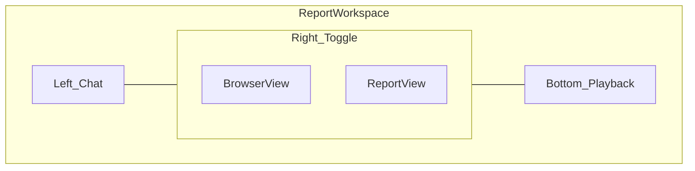

# Report workspace interface

**Status:** Approved interface spec (August 2026). Engineering and design source for report workspace chrome.

**Canonical for:** layout regions, view modes, browser modes, playback strip, mobile behavior, and on-screen terminology.

**Related:** Product requirements live in [product-prd.md](./product-prd.md). Visual tokens and component rules live in [DESIGN.md](../DESIGN.md). Report section order and anchors follow [knowledge/report-contract.md](../knowledge/report-contract.md) (Funnel anchor: `report-funnel`).

**Implementation:** The interactive split workspace lives in [ReportWorkspaceSplitShell](../components/report/ReportWorkspaceSplitShell.tsx) with progressive parity in [AuditReportProgressive](../components/audit/AuditReportProgressive.tsx). Do not fork a second report app.

---

## Layout regions (desktop)

| Region | Purpose |
|--------|---------|
| **Left — Chat** | Persistent conversation with FixFlags: steering, Flag Q&A, “what to fix first”, lightweight product corrections. Activity stream may live here or above chat. Chat uses a cheap router model, not the judge pipeline. |
| **Right — Browser** | Dominant panel. User toggles **Browser view** vs **Report view** in the same workspace (not a separate route). |
| **Bottom — Playback** | Timeline/scrub strip for path replay and step evidence. Syncs with the browser when a path or Flag evidence is selected. FullStory-style scrub for deep review; step markers for product review. |

---

## View modes (right panel toggle)

### Browser view

Shows the product as FixFlags experienced it.

**Product review mode** — programmatic capture. Playwright-driven browser with screenshot-forward evidence (today’s pipeline). User sees live or stepped captures aligned to checks; not full agent autonomy.

**Deep review mode** — agent-class browser. Autonomous navigation and interaction comparable to power-user browsing (multi-step journeys, funnel traversal, path recording). Public marketing explains this as agent-level browser exploration without naming competitors as endorsement.

### Report view

Today's **Fix list** toggle shows the ranked Fix list and Flag detail inside `#report-flags`. Progress band, Contract, Funnel, previews, and update review affordances stay in the canonical report column around the workspace split.

---

## Morph behavior

| Phase | Default right panel | Chrome |
|-------|---------------------|--------|
| **Active review** | Browser view (dominant) | Chat left; playback bottom when steps exist |
| **After complete** | Report view for triage | User can switch back to Browser view for replay and evidence |

---

## Funnel, paths, and playback

- **Funnel** — journeys listed inside the report map (same report, not a separate product area).
- **Path** — opens from Funnel or Flag evidence; full session-style replay in the browser panel with scrub timeline and evidence continuity.
- **Playback strip** — bottom of workspace; proves the finding without imagination. Target is replay-grade scrub in-product, not static screenshot galleries only.

---

## Update review

- **Update review** is a primary header action on completed reports (owner).
- **Compare** is the Pro payoff: before/after proof after update review; diff strip (cleared / remaining / new) on child reports.
- Customer term: **Update review** (not re-check). Internal route `/re-check` may remain until API migration.

---

## Chat policy

- Chat is **owner-only**. The owner sees the panel on live, completed, and update review reports; shared viewers (password share) get no chat panel.
- Scope: explain Flags, steer review, ask what to fix first, lightweight corrections to product understanding. Not a general coding agent.
- **Model:** cheapest viable chat model, configured separately from judge and triage. `CHAT_MODEL` / `CHAT_MAX_TOKENS` / `CHAT_TIMEOUT_MS` default to the cheapest model per provider; `CHAT_BASE_URL` routes chat through an OpenAI-compatible gateway (for example the opencode gateway) as the router equivalent.
- Requirements: separate chat model config from judge/triage (shipped); hard cap per session/plan (`CHAT_SESSION_CAP`, default 20 user turns per report); degrade to canned actions (“Explain this Flag”, “What should I fix first?”) if the provider is unavailable. Canned replies are deterministic and grounded in the report’s own Flags.

---

## Mobile

Full parity. No degraded subset.

| Capability | Requirement |
|------------|-------------|
| Start product review | Yes |
| Watch progress / activity | Yes |
| Chat with FixFlags | Yes |
| Browse Fix list and Flag detail | Yes |
| View evidence and path replay | Adapted layout |
| Run update review and see diff | Yes |
| Account, billing, usage meters | Yes |

**Primary switch:** Lovable-style **Chat ↔ Product** (tabs or bottom bar). Report view accessible without stripped features.

**Playback on small screens:** bottom strip or full-screen takeover — layout choice is open (see [product-prd.md](./product-prd.md) open questions).

**Patterns (reference, not clone):** device toggle above preview on desktop; live preview stays central; 44px targets; “Open on phone” / share preview link for testing captured URL on device.

---

## Customer labels on chrome

Wire from [lib/marketing/copy/terminology.ts](../lib/marketing/copy/terminology.ts):

| Label | Use on chrome |
|-------|----------------|
| Product review | Standard full pass |
| Deep review | Journey + funnel + path mode |
| Update review | Re-run on same URL (header CTA) |
| Funnel | Report section |
| Path | Playback unit |
| Fix list | Ranked work queue |

Do not show **re-check** in customer UI.

---

## Shipped vs target (interface)

| Area | Today | Target |
|------|-------|--------|
| Layout | Split workspace during live; report chrome after complete | Same |
| Browser | Live captures in right panel; selected playback step renders that captured frame | Deep review (agent-class) live browser |
| Playback | Scrub timeline + step markers; browser frame updates on select; activity click seeks; `?step=N` replay from Flag/Funnel evidence | Full session-style takeover replay |
| Chat | In-app left panel, owner-only, dedicated `CHAT_*` model, per-plan cap, canned actions on outage | Same |
| Funnel | Section + journey list + Replay path into the workspace browser | Same |
| Mobile | Chat ↔ Product parity, adapted playback | Full-screen path replay |
| View toggle | Browser ↔ Fix list in the same workspace | Same |

## Resolved design questions

1. Chat ↔ Product on mobile: **tab switch** (Lovable-style) shipped. Swipe/FAB remain open alternatives.
2. Path replay layout: inline playback strip + step evidence shipped on all sizes; full-screen takeover remains open.
3. Deep review teaser on Free (one journey playback vs summary-only) — open.
4. Takeover (user controls browser) — follow-on, not first release.
